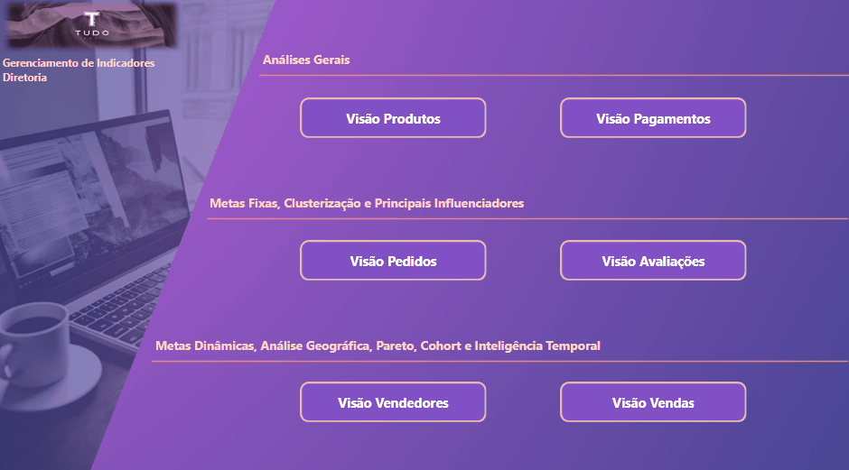

# Projeto em Power BI
## 0.0 - O problema de negócio

___

A empresa **Tudo Aqui ©** atua no setor de e-commerce e deseja adotar uma metodologia *data driven* para tomada de decisões estratégicas, de forma a melhorar a precisão das análises realizadas.

Dessa forma, o CEO da empresa decidiu implementar *Business Inteligence* na cultura da empresa através da contratação de um analista de dados, que deve então entregar análises e insights para o negócio através do uso do *Power BI* como principal ferramenta de ETL e visualização.

As análises seguirão tomando uma frente da base de dados por vez, ou seja, compreendendo a entrega de 2 dashboards para cada frente de análise: *Produto, Pagamentos, Pedidos, Avaliações, Vendedores e Vendas*.

## 1.0 - Frente Produtos

___

### 1.1 Primeiro Dashboard
Para o primeiro Dashboard da Visão de Produtos, o CEO fez as seguintes solicitações - A serem obtidas através de funções de **agregação**:

1. Quantidade de Produtos Cadastrados;
2. Quantidade Total de Categorias;
3. Quantidade Total de Fotos;
4. Quantidade de Produtos por Categoria;
5. Quantidade de Fotos por Categoria;

Também foi exigido que o dashboard fosse formatado com as cores padrão da empresa (a ser adotado também na formatação de todos os outros dashboards), além de um filtro por categoria de produto.

### 1.2 Segundo Dashboard

1. Quantidade de Categorias únicas por altura;
2. Quantidade de Categorias únicas por comprimento;
3. Quantidade de Fotos por produto;
4. Quantos produtos possuem mais de 15 fotos;
5. 2 visuais com insights personalizados.

## 2.0 - Frente Pagamentos

___

Aprovadas as análises feitas na primeira frente de dados da empresa, o segundo ciclo - _Pagamentos_ - segue com solicitações de análises cada vez mais específicas quanto aos **níveis de granularidade em observação**, a saber:

### 2.1 Primeiro Dashboard

As análises foram:

- **Cartões**
    1. Quantidade de Pedidos;
    2. Valor Total de Pagamentos;
    3. Quantidade de Pagamentos;
    4. Quantidade de Pagamentos por tipo de pagamento

- **Gráficos**
    1. Valor Total de Pagamentos ( Por Status do Pedido);
    2. Quantidade de Pagamentos (Por Tipo de Pagamento);
    3. Hierarquia de Valor médio de pagamentos por status do pedido e pelo tipo de pagamento;
    4. Detalhes dos pedidos por tipo de pagamento e pela quantidade de pagamentos

- **Segmentações**
    1. Número do Pedido;
    2. Tipo de Pagamento;
    3. Status do Pedido

### 2.2 Segundo Dashboard

1. Valor de pagamento total por status do pedido (Um por cartão);
2. Gráfico de Barras com a quantidade de pedidos por status do pedido e por tipo de pagamento;
3. Uma hierarquia da contagem de pedidos por status do pedido, tipo de pagamento, sequência de pagamento e número do pedido;
4. Uma Tabela detalhada por pedido e por tipo de pagamento com a quantidade de pagamentos, valor de pagamento total e a média de valor de pagamento;
5. Gráfico de rosca com a quantidade de clientes únicos por status de pedido

Novamente, para esse segundo dashboard de uma frente de dados, foi tomada a liberdade pra 2 visuais contendo insights do analista a respeito das visões pedidas.

## 3.0 - Frente Pedidos

___

A visão de Pedidos dará início às avaliações de *inteligência temporal*. Nesse ponto do desenvolvimento dos ciclos do projeto, o CEO da empresa deseja saber como a empresa está *avançando em relação as metas estabelecidas* para o ano atual e como a empresa está posicionada em relação a dados de anos anteriores.

### 3.1 Primeiro Dashboard

As seguintes análises foram solicitadas:

- **Cartões**
    1. Quantidade de Pedidos;
    2. Quantidade de Clientes;
    3. Quantidade de Pedidos do ano de 2017;
    4. Quantidade de Pedidos do ano de 2018;
    5. Taxa de Crescimento (2017 ~ 2018)

- **Análises Gráficas**
    1. Quantidade de Pedidos x Meta Anual;
    2. Quantidade de Pedidos x Meta Mensal de 2018;
    3. Quantidade de Pedidos por Estado do Cliente;
    4. Detalhes da Quantidade de Pedidos e Meta de Pedidos por ano, mês, Estado e cidade do cliente.
    
    **Importante**: O valor de meta foi definido como sendo 60% sobre o período de comparação do ano anterior - considerando os efeitos da sazonalidade.
    
- **Segmentação**
    1. Data de Compra;
    2. Ano / Mês de Compra;
    3. Estado do Cliente;
    4. Cidade do Cliente;
    5. Status do Pedido

### 3.2 Segundo Dashboard

1. Cartão - Quantidade de Clientes únicos nos anos de 2017 e 2018;
2. Cartão - Quantidade de pedidos para o ano de 2016;
3. Cartão - Taxa de crescimento entre os anos de 2016 e 2017;
4. Um KPI com a quantidade de pedidos realizados no grão do dia com uma meta de 40%;
5. Uma matriz que exiba a quantidade de pedidos do ano atual e a quantidade de pedidos do ano anterior nos níveis de ano, mês e dia;
6. Inclusão na Matriz uma lógica c/ emoji comparando os indicadores mencionados no tópico anterior;
7. Um gráfico de área por Estado e cidade do cliente;
8. 3 gráficos com insights personalizados dos dados. 2 deles deverão conter lógicas com a coluna order_status.

## 4.0 - Frente Avaliações

___

Nesta visão, objetiva-se saber quais são os principais influenciadores para avaliações que são classificadas como *ruins, médias e boas* lançando mão de análises de *clusterização da quantidade média de avaliações* para obtenção dos insights.

**IMPORTANTE**: Nesse projeto, a definição das regras de negócio para classificação e tipo de avaliação foram criadas com a finalidade de simular um contexto de negócios.  Em situação real, cabe ao analista ser **neutro** quanto a definição dessas regras, SEMPRE validando com o negócio tais definições de forma a andar em parceria com os stakeholders.
Dessa forma, as regras assumidas para as segmentações foram: 

- _Classificação da Avaliação_
    - Quando _review_score_ é 1, a classificação é ‘péssima’;
    - Quando _review_score_ é 2 ou 3, a classificação é ‘média’;
    - Quando _review_score_ é 4 ou 5, a classificação é ‘ótima’.
- _Tipo de Avaliação_
    - Quando o ano da data _review_creation_date_ é 2016 e o _Estado do cliente_ é SP, o tipo de avaliação é ‘implantação’;
    - Quando o ano da data _review_creation_date_ é 2017 e o mês da data em _review_creation_date_ é Maio, o tipo de avaliação é ‘evento’;
    - Para todos os outros casos, o tipo de avaliação é ‘rotineira’.

### 4.1 Primeiro Dashboard

As solicitações foram:

- **Cartões**

1. Quantidade de avaliações únicas;
2. Quantidade de avaliações únicas para o score 4 e 5;
3. Média de tempo em dias das avaliações que não receberam retorno no mesmo dia que a avaliação foi criada;
4. Média de tempo em horas das avaliações que não receberam retorno no mesmo dia que a avaliação foi criada;
5. Quantidade de avaliações únicas para o score 4 e 5 dos clientes dos Estados de SP e RJ apenas do ano de 2018;
6. Taxa de crescimento entre os anos de 2018 e 2017 para os clientes score 4 e 5 dos Estados de SP e RJ

- **Análises Gráficas:**

1. Um gráfico de dispersão clusterizado por Estado do cliente, quantidade de avaliações únicas e a média de tempo em dias das avaliações que não receberam retorno no mesmo dia que a avaliação foi criada;
2. Um gráfico de pizza que exibe a quantidade de avaliações únicas pela classificação da avaliação;
3. Um gráfico com os principais influenciadores entre classificação das avaliações e Estado do cliente.

- **Segmentações**:

1. Data de Criação da Avaliação;
2. Ano e mês da criação da avaliação;
3. Estado do Cliente;
4. Cidade do Cliente;
5. Classificação da Avaliação;
6. Tipo de Avaliação.

### 4.2 Segundo Dashboard

1. Cartão - Quantidade de avaliações únicas do score 1,2 e 3 dos estados de MG, RJ, PR e SC do ano de 2018;
2. CArtão - Taxa de crescimento do indicador criado no tópico 1 em relação aos mesmos dados de 2017;
3. Qual é a relação existente entre as métricas média de dias de avaliação e a quantidade de avaliações únicas de score 3 e 4 por Estado do Cliente? (Definição por Clusterização);
4. Qual é a relação existente entre as métricas média de dias de avaliação e a quantidade de avaliações únicas de score 1 e 2 por Estado do Cliente? (Definição por Clusterização);
5. Agrupamento dos dados do gráfico criado no tópico 3 em 6 clusters.
7. 2 Gráficos com Insights personalizados dos dados.

## 5.0 - Frente Vendedores

___
Nesta visão, os *stakeholders* desejam ter uma visão do _top 10 Estados_ dos vendedores que mais vendem, _um mapa_ com a concentração de vendedores por região do Brasil, _uma tabela detalhada_ com as principais métricas e indicadores solicitados e _um gráfico com acompanhamento dinâmico_ das metas esperadas.

### 5.1 Primeiro Dashboard

As análises pedidas foram:

- **Cartões**:

1. Quantidade Total de Vendedores _(Detalhes de Vendedores)_
2. Total de Vendas
3. Total de Vendas dos itens com valor superior a R$500.000 _(Detalhes de itens Vendidos)_
4. Quantidade de Vendedores que venderam itens com valor superior a R$500.000
5. Quantidade de Vendedores que venderam dentro ou acima da meta

-   **Análises Gráficas**:

1. Um gráfico de Funil para apresentar os top 10 Estados dos vendedores que mais vendem
2. Um gráfico de Mapa que contenha a quantidade de vendedores e demonstre essa informação por país, estado e cidade dos vendedores. _(Detalhes Geográficos)_
3. Um gráfico de acompanhamento dinâmico de meta média por item que permita alterar dinâmicamente os valores das metas na tela do dashboard.
4. Uma tabela com os detalhes por vendedor e seus respectivos estados que contenha o total de vendas, o total de venda de itens acima de R$500.000, a representação do valor de vendas de cada vendedor em relação ao todo, a representação do valor de vendas de cada vendedor em relação ao que está filtrado nas segmentações e quais vendedores venderam dentro ou acima da meta.

-   **Segmentações**:

1. ID do Vendedor
2. Cidade do Vendedor
3. Estado do Vendedor

Através do primeiro dashboard criado, o CEO e o corpo Diretivo da empresa conseguem agora analisar valores de vendas, estabelecer , simular e monitorar metas de forma dinâmica, analisar as maiores concentrações de vendedores em todo o Brasil com acompanhamento da performance individual de cada vendedor.

### 5.2 Segundo Dashboard

1. Um KPI dinâmico para avaliação de metas para o total vendido. O KPI deve permitir a variação entre R$10.000 e R$2.000.000 com intervalos de R$50.000. Usar a cor azul para valores dentro da meta e laranja/vermelho para valores fora da meta.
2. Um funil com o TOP 15 cidades com vendedores que mais pagam frete.
3. Uma tabela que replique as  mesmas análises e formatação condicionais que foram feitas no primeiro dashboard, agora para análises e lógicas sob o valor de frete. OBS: Na análise onde o indicador de vendas era > R$500.000, fazer Frete > R$25.000.
4. Criar um mapa com layout diferente para a navegação por País, Estado e Cidade através do total vendido.
5. Uma análise que mostre quantos vendedores estão abaixo ou acima da meta dinâmica de total vendido.
6. 2 gráficos com insights do analista.

## 6.0 - Frente Vendas

___

As análises esperadas pela frente de Vendas envolvem conceitos mais avançados dentro dos conhecimentos de técnicas para análise de dados e Estatística, como _Análise de Pareto 80-20, Vendas Acumuladas (Análises ‘YTD’ - Year to Date), Comparativo de Vendas por Ano, Taxas de Crescimento Acumulado, Análise de Cohort_, entre outras.

### 6.1 Primeiro Dashboard

-   **Cartões:**

1. Total de Vendas;
2. Total Acumulado YTD (Ano Atual);
3. Total Acumulado YTD (Ano Anterior);
4. Taxa de Crescimento Acumulado (Ano Atual x Ano Anterior);
5. % de Desconto de Frete;
    *Regra Adotada: Itens com preço igual ou superior a R$10.000 possuem 50% de desconto no frete.*
    

-   **Análises Gráficas:**

1. Uma análise de *Pareto 80-20* com o total de vendas por Estado de compra;
2. Total de *Vendas Acumuladas mês a mês* exibindo todos os anos na tela;
3. Uma análise de *% Retenção de vendedores com COHORT*;
4. Uma análise que exiba o *Total de Vendas do Ano Atual x Ano Anterior* mês a mês em conjunto com a taxa de crescimento, exibindo todos os anos em tela.

**Segementações:**

1. Segmentação estilo ‘entre valores’ da Data de Envio (considere a coluna *shipping_limit_date*);
2. Ano/Mês;
3. ID do Pedido;
4. ID do Comprador;
5. ID do Vendedor;
6. ID do produto;
7. Estado de Compra;
8. Cidade de Compra

### 6.2 Segundo Dashboard

Para o segundo Dashboard, a solicitação feita foi a de um dashboard análogo ao primeiro, apenas substituindo as lógicas de análise de valores de vendas para *valores de frete*.

*Observações:* A regra para cálculo do % de Desconto de Frete a ser adotada deverá ser → *Itens com preço de venda igual ou superior a R$5.000 deverão ter 40% de desconto no valor do frete.*

A Análise de COHORT deverá ser feita usando o campo *order_delivered_customer_date* que está contido na tabela *orders*.

## 7.0 Apresentação Final

___

Ao término do desenvolvimento de todas as análises, o relatório foi preparado visando uma navegação agradável e eficiente pelos diferentes dashboards, com um menu de acesso e botões em cada página que permitem a visualização de todos os visuais apenas através da postagem de um link público.

O relatório final completo está disponibilizado em: 

|         **Click no botão abaixo para acessar o relatório final completo**        |
|:------------------------:|
|        

